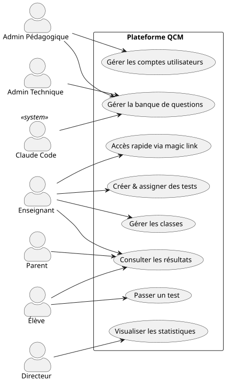
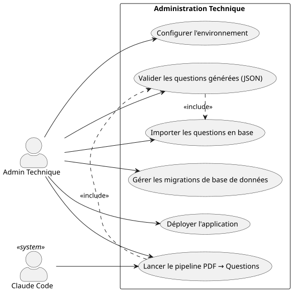
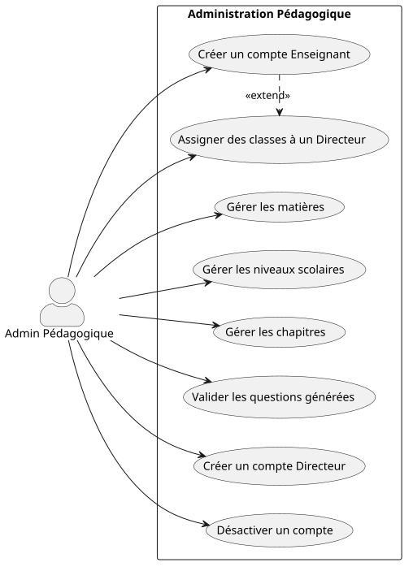
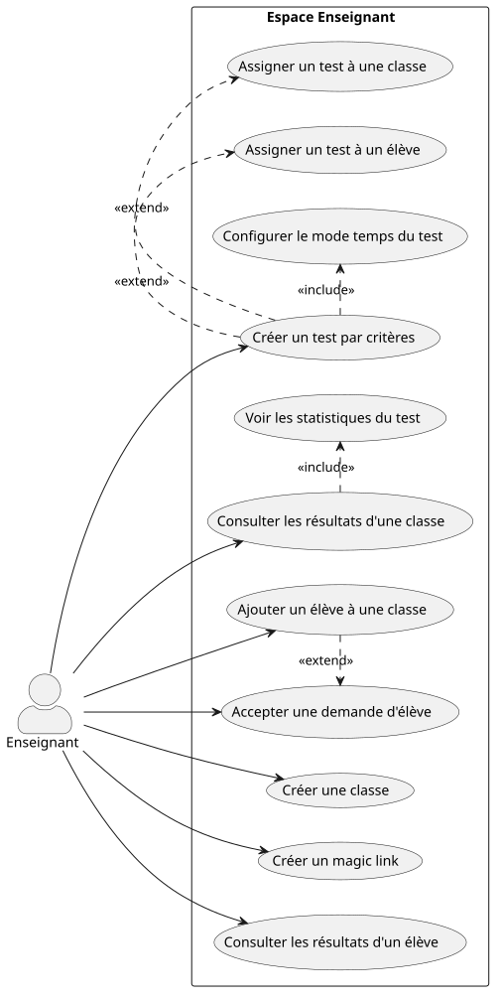
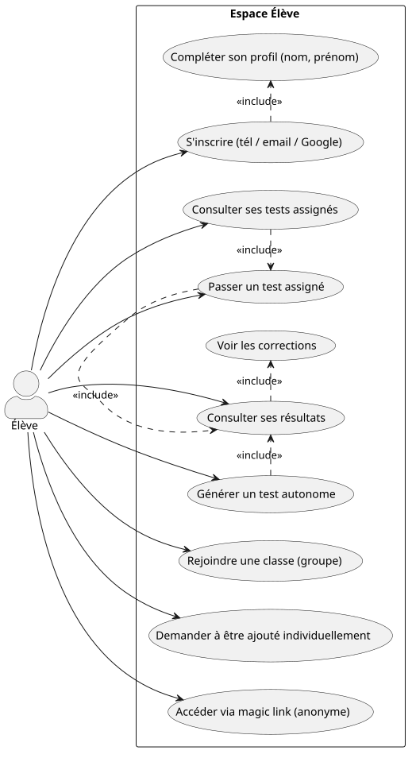
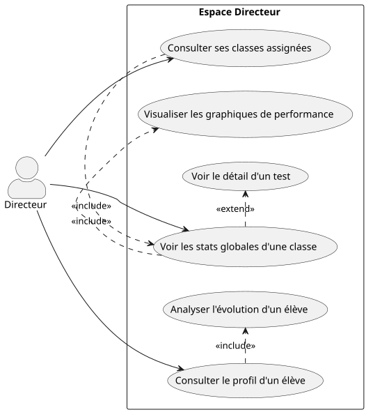
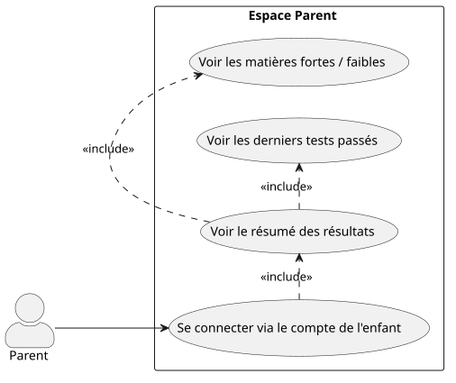
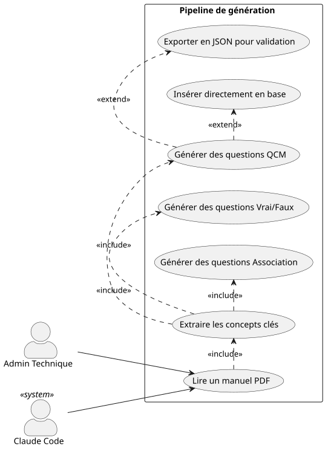

# SPEC PROJET — Plateforme Quiz Pédagogique (Mauritanie)
**Version** : 3.0  
**Date** : 11 avril 2026  
**Statut** : Spécification étendue — Acteurs & Cas d'utilisation

---

## Vision

Plateforme web de quiz pédagogique alignée sur le programme mauritanien.  
L'admin technique peuple la banque de questions depuis des manuels PDF via Claude Code.  
Les enseignants créent des tests, suivent leurs élèves et gèrent leurs classes.  
Les élèves s'évaluent en mode supervisé (tests assignés) ou en mode autonome (auto-générés).  
Les directeurs et parents disposent de vues analytiques adaptées à leur rôle.

---

## Acteurs du système

| # | Acteur | Nature | Description |
|---|--------|--------|-------------|
| 1 | **Admin Technique** | Humain | Gère la base de données, les scripts, le déploiement et le pipeline Claude Code |
| 2 | **Admin Pédagogique** | Humain | Valide les questions, gère les matières/niveaux/chapitres et les comptes utilisateurs |
| 3 | **Enseignant** | Humain | Crée et gère des classes, assigne des tests, suit les résultats de ses élèves |
| 4 | **Élève** | Humain | Passe des tests assignés ou autonomes, consulte ses résultats |
| 5 | **Directeur/Superviseur** | Humain | Visualise les statistiques des classes qui lui sont assignées |
| 6 | **Parent** | Humain | Consulte un résumé simplifié des résultats de son enfant |
| 7 | **Claude Code** | Système | Génère et injecte automatiquement des questions dans la banque |

---

## Diagramme des acteurs — Vue globale



---

## Cas d'utilisation par acteur

---

### 1. Admin Technique



**Cas d'utilisation détaillés :**

| ID | Cas d'utilisation | Description |
|----|-------------------|-------------|
| AT-01 | Lancer le pipeline | Fournit des PDFs de manuels scolaires à Claude Code pour extraction |
| AT-02 | Valider les questions | Relit les questions générées en JSON avant import |
| AT-03 | Importer en base | Exécute le script d'import PostgreSQL |
| AT-04 | Gérer les migrations | Crée/modifie le schéma de la base via scripts Bun |
| AT-05 | Déployer | Met en production l'application Next.js |
| AT-06 | Configurer | Gère les variables d'environnement et la config serveur |

---

### 2. Admin Pédagogique



**Cas d'utilisation détaillés :**

| ID | Cas d'utilisation | Description |
|----|-------------------|-------------|
| AP-01 | Gérer les matières | Créer/modifier/supprimer les matières (Maths, Physique…) |
| AP-02 | Gérer les niveaux | Créer/modifier les niveaux scolaires (6ème, Terminale…) |
| AP-03 | Gérer les chapitres | Créer/modifier les chapitres par matière et niveau |
| AP-04 | Valider les questions | Approuver/rejeter les questions en attente de validation |
| AP-05 | Créer compte Enseignant | Crée le profil d'un enseignant dans le système |
| AP-06 | Créer compte Directeur | Crée le profil d'un directeur/superviseur |
| AP-07 | Assigner classes | Lie des classes à un directeur pour sa vue analytique |
| AP-08 | Désactiver compte | Suspend l'accès d'un utilisateur sans supprimer ses données |

---

### 3. Enseignant



**Cas d'utilisation détaillés :**

| ID | Cas d'utilisation | Description |
|----|-------------------|-------------|
| ENS-01 | Créer une classe | Définit : nom de l'établissement, niveau, filière, nom de classe |
| ENS-02 | Ajouter un élève | Ajoute un élève individuellement ou via groupe |
| ENS-03 | Accepter demande | Valide la demande d'un élève qui veut rejoindre sa classe |
| ENS-04 | Créer magic link | Génère un lien pour accès rapide anonyme (évaluation ponctuelle) |
| ENS-05 | Créer un test | Sélectionne : matière, niveau, chapitre, difficulté, nombre de questions |
| ENS-06 | Configurer le temps | Choisit : pas de limite / chrono obligatoire / date limite de soumission |
| ENS-07 | Assigner à une classe | Publie le test pour toute une classe |
| ENS-08 | Assigner à un élève | Publie le test pour un élève en particulier |
| ENS-09 | Résultats classe | Vue agrégée : moyenne, meilleure/pire note, distribution |
| ENS-10 | Résultats élève | Vue détaillée par élève : note, réponses, temps |
| ENS-11 | Stats du test | Analyse question par question : taux de réussite par question |

---

### 4. Élève



**Cas d'utilisation détaillés :**

| ID | Cas d'utilisation | Description |
|----|-------------------|-------------|
| ELV-01 | S'inscrire | Via numéro de téléphone (OTP), email + mot de passe, ou Google OAuth |
| ELV-02 | Compléter profil | Saisit son nom et prénom après connexion (obligatoire) |
| ELV-03 | Rejoindre une classe | Envoie une demande à l'enseignant pour rejoindre un groupe |
| ELV-04 | Demande individuelle | Demande à être suivi individuellement par un enseignant |
| ELV-05 | Accès magic link | Accès rapide sans compte pour une évaluation anonyme ponctuelle |
| ELV-06 | Tests assignés | Consulte la liste des tests donnés par ses enseignants |
| ELV-07 | Passer un test | Répond aux questions dans le temps imparti ou avant la deadline |
| ELV-08 | Test autonome | Choisit matière + chapitre + difficulté → le système génère le test |
| ELV-09 | Consulter résultats | Voit son score immédiatement après soumission |
| ELV-10 | Voir corrections | Accède aux bonnes réponses après soumission |

**Tableau de bord élève :**

```
┌─────────────────────────────────────────────────────┐
│  Bonjour, [Prénom]                                  │
├─────────────────────────────────────────────────────┤
│  📋 Tests assignés par mes profs (à faire)          │
│     └── [Test Maths - Terminale - avant 15/04]      │
├─────────────────────────────────────────────────────┤
│  📊 Historique — Tests supervisés                   │
│     └── [Test Physique - 12/04 - 14/20]             │
├─────────────────────────────────────────────────────┤
│  🎯 Historique — Tests autonomes                    │
│     └── [Maths - Dérivées - 10/04 - 18/20]         │
├─────────────────────────────────────────────────────┤
│  [ + Nouveau test ]                                 │
└─────────────────────────────────────────────────────┘
```

---

### 5. Directeur / Superviseur



**Cas d'utilisation détaillés :**

| ID | Cas d'utilisation | Description |
|----|-------------------|-------------|
| DIR-01 | Voir ses classes | Liste des classes qui lui sont assignées par l'Admin Pédagogique |
| DIR-02 | Stats globales | Par test : meilleure note, pire note, moyenne, distribution |
| DIR-03 | Détail d'un test | Résultats question par question pour la classe |
| DIR-04 | Profil élève | Consulte les résultats de tous les tests d'un élève |
| DIR-05 | Évolution élève | Graphique de progression dans le temps par matière/chapitre |
| DIR-06 | Graphiques | Visualisation : histogrammes, courbes de progression |

---

### 6. Parent



**Cas d'utilisation détaillés :**

| ID | Cas d'utilisation | Description |
|----|-------------------|-------------|
| PAR-01 | Se connecter | Utilise les identifiants du compte de l'enfant |
| PAR-02 | Résumé résultats | Vue simplifiée : moyennes, tendances générales |
| PAR-03 | Matières fortes/faibles | Indicateurs visuels simples (vert/rouge) par matière |
| PAR-04 | Derniers tests | Liste des 5 derniers tests avec date et note |

> ⚠️ Le parent a une **vue en lecture seule dédiée**, différente de la vue élève. Il ne peut pas passer de tests ni modifier quoi que ce soit.

---

### 7. Claude Code (Acteur Système)



---

## Structure des classes scolaires

Une classe dans le système reflète une vraie classe scolaire :

```
Classe {
  etablissement    → "Lycée Ibn Khaldoun"
  wilaya           → "Nouakchott"
  niveau           → "Terminale"
  filiere          → "Sciences Expérimentales"
  nom_classe       → "Terminale SE - Groupe 2"
  annee_scolaire   → "2025-2026"
  enseignants[]    → [Prof Maths, Prof Physique]
  eleves[]         → [liste des membres]
}
```

---

## Organisation de la banque de questions

Hiérarchie à 4 niveaux :

```
Matière
  └── Niveau scolaire
        └── Chapitre / Thème
              └── Difficulté (Facile / Moyen / Difficile)
                    └── Questions
```

**Exemple :**
```
Mathématiques
  └── Terminale SE
        └── Dérivées et étude de fonctions
              ├── [Facile]  Qu'est-ce que la dérivée de x² ?
              ├── [Moyen]   Étudier le sens de variation de f(x) = x³ - 3x
              └── [Difficile] Démontrer que f admet un maximum en x = ...
```

---

## Types de questions — Format

### QCM
```json
{
  "type": "qcm",
  "content": "Quelle est la capitale de la Mauritanie ?",
  "options": ["Nouakchott", "Nouadhibou", "Kiffa", "Rosso"],
  "correct_answer": "Nouakchott",
  "difficulty": "facile"
}
```

### Vrai / Faux
```json
{
  "type": "true_false",
  "content": "Le triangle équilatéral a tous ses angles égaux.",
  "correct_answer": "true",
  "difficulty": "facile"
}
```

### Glisser-déposer / Association
```json
{
  "type": "matching",
  "content": "Associez chaque organe à sa fonction.",
  "pairs": [
    { "left": "Poumons",  "right": "Respiration" },
    { "left": "Cœur",    "right": "Circulation sanguine" },
    { "left": "Foie",    "right": "Filtration du sang" }
  ],
  "difficulty": "moyen"
}
```

---

## Modes de contrainte temporelle des tests

| Mode | Configuration | Comportement |
|------|--------------|--------------|
| **Libre** | Pas de limite | L'élève soumet quand il veut |
| **Chrono** | Durée en minutes (ex: 45 min) | Compte à rebours — soumission automatique à 0 |
| **Date limite** | Date + heure précise | L'élève peut commencer avant mais doit soumettre avant la deadline |

Tous les modes sont configurés par l'enseignant à la création du test.

---

## Authentification élève

| Méthode | Détail |
|---------|--------|
| **Téléphone + OTP** | Numéro de tél → code SMS temporaire |
| **Email + mot de passe** | Inscription classique |
| **Google OAuth** | Connexion via compte Gmail |
| **Magic link (anonyme)** | Accès ponctuel sans compte, pour évaluations rapides |

> Après toute inscription avec compte, l'élève doit renseigner son **nom et prénom** (obligatoire).

---

## Structure des données (v3)

### Table `users`
- id, role (admin_tech | admin_ped | enseignant | eleve | directeur | parent)
- auth_method (phone | email | google)
- phone, email, google_id
- first_name, last_name
- created_at, is_active

### Table `etablissements`
- id, nom, wilaya, ville

### Table `classes`
- id, etablissement_id, niveau, filiere, nom, annee_scolaire
- created_by (enseignant_id)

### Table `classe_enseignants`
- classe_id, enseignant_id

### Table `classe_eleves`
- classe_id, eleve_id, joined_at, status (pending | active)

### Table `directeur_classes`
- directeur_id, classe_id

### Table `subjects`
- id, name, language (ar | fr)

### Table `levels`
- id, name, order

### Table `chapters`
- id, subject_id, level_id, title, description

### Table `questions`
- id, chapter_id, type (qcm | true_false | matching)
- content, options (JSON), correct_answer (JSON)
- difficulty (facile | moyen | difficile)
- source, created_by ('claude_code'), validated, created_at

### Table `magic_links`
- id, token (uuid), created_by (enseignant_id)
- level_id (optionnel), expires_at, max_uses, use_count

### Table `tests`
- id, created_by (enseignant_id)
- subject_id, level_id, chapter_id, difficulty
- question_count, time_mode (libre | chrono | deadline)
- duration_minutes, deadline_at
- created_at

### Table `test_questions`
- test_id, question_id, order

### Table `test_assignments`
- id, test_id, target_type (classe | eleve)
- target_id, assigned_at

### Table `sessions`
- id, test_id, eleve_id, magic_link_id (nullable)
- started_at, submitted_at, score, is_anonymous

### Table `answers`
- id, session_id, question_id, given_answer (JSON)
- is_correct, answered_at

---

## Pipeline de génération de questions (v3)

```
Manuels scolaires mauritaniens (PDF)
              ↓
    Claude Code (Admin Technique)
    (lecture PDF + extraction + génération)
              ↓
     ┌─────────────────────────────────┐
     │ Cas confiant                    │ → Insert direct PostgreSQL (validated=true)
     │ Cas à valider                   │ → Fichier JSON
     │                                 │   → Relecture Admin Pédagogique (interface)
     │                                 │   → Script d'import PostgreSQL (validated=true)
     └─────────────────────────────────┘
              ↓
     Banque de questions PostgreSQL
     (Matière > Niveau > Chapitre > Difficulté)
              ↓
     App Next.js (Bun)
              ↓
     ┌─────────────────────────────┐
     │ Enseignant → Test assigné   │
     │ Élève → Test autonome       │
     │ Magic link → Accès anonyme  │
     └─────────────────────────────┘
```

---

## Périmètre MVP vs Vision complète

### ✅ MVP — Phase 1
- Banque de questions : une matière pilote, tous niveaux
- Accès élève via magic link (anonyme)
- Test autonome (élève choisit matière/chapitre/difficulté)
- Correction immédiate avec bonnes réponses
- Pipeline Claude Code → PostgreSQL
- Déploiement local

### 🔄 Phase 2
- Inscription élève (email + mot de passe)
- Création de classes par les enseignants
- Tests assignés par l'enseignant
- Modes chrono et deadline
- Tableau de bord enseignant (résultats)

### 🔄 Phase 3
- Google OAuth + OTP téléphone
- Tableau de bord directeur (stats + graphiques)
- Vue parent simplifiée
- Interface admin pédagogique (validation questions)
- Plusieurs matières

### ❌ Hors scope (pour l'instant)
- Notifications (email/SMS)
- Application mobile native
- Mode hors-ligne

---

## Stack technique

| Couche | Technologie |
|--------|-------------|
| Runtime serveur | Bun.js |
| Framework | Next.js LTS (App Router) |
| Base de données | PostgreSQL |
| Auth | Lucia Auth / NextAuth.js |
| Génération questions | Claude Code |
| Déploiement | Local (localhost) → VPS |

---

## Points encore ouverts

- [ ] Quelle est la matière pilote choisie ?
- [ ] Langue(s) de l'interface : français, arabe, ou bilingue ?
- [ ] ORM ou SQL pur pour PostgreSQL avec Bun ?
- [ ] Format et durée de validité du magic link ?
- [ ] Nombre minimum de questions par chapitre pour lancer un test ?
- [ ] Wilaya(s) ciblée(s) pour le pilote ?
- [ ] Système de filières : liste fixe ou configurable ?

---

*Document évolutif — v3.0 — prochaine mise à jour : schéma SQL complet + maquettes écrans*
